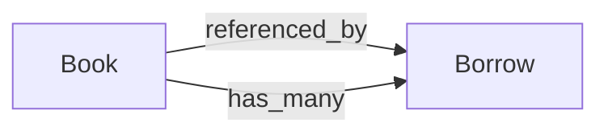

# Library Management API with Express, TypeScript & MongoDB

## 📌 Objective

Develop a Library Management System using:

- Express
- TypeScript
- MongoDB (via Mongoose)

## 🔧 Core Requirements

- Proper schema validation
- Business logic enforcement
- Aggregation pipeline usage
- Mongoose static/instance methods
- Mongoose middleware
- Filtering features

## 📚 Models

### Book Model

**Fields:**

- `title` (string, required)
- `author` (string, required)
- `genre` (string, required - enum: FICTION, NON_FICTION, SCIENCE, HISTORY, BIOGRAPHY, FANTASY)
- `isbn` (string, required, unique)
- `description` (string, optional)
- `copies` (number, required, non-negative)
- `available` (boolean, defaults to true)

### Borrow Model

**Fields:**

- `book` (ObjectId, required, references Book)
- `quantity` (number, required, positive)
- `dueDate` (Date, required)

## 📍 API Endpoints

### 1. Book Management

| Method | Endpoint         | Description                            |
| ------ | ---------------- | -------------------------------------- |
| POST   | `/api/books`     | Create a new book                      |
| GET    | `/api/books`     | Get all books (with filtering/sorting) |
| GET    | `/api/books/:id` | Get a specific book                    |
| PUT    | `/api/books/:id` | Update a book                          |
| DELETE | `/api/books/:id` | Delete a book                          |

### 2. Borrow Management

| Method | Endpoint      | Description                                    |
| ------ | ------------- | ---------------------------------------------- |
| POST   | `/api/borrow` | Borrow a book (with business logic)            |
| GET    | `/api/borrow` | Get borrowed books summary (using aggregation) |

## 🔄 Business Logic for Borrowing

1. Verify available copies
2. Deduct quantity from book's copies
3. Update `available` to false if copies reach 0
4. Save borrow record

## 📊 Aggregation Pipeline

For borrowed books summary:

1. Group by book
2. Sum total quantity per book
3. Include book details (title, isbn)

## 🚨 Error Response Format

```json
{
 "success": false,
  "message": "Error message",
  "error": { ... }
}
```

## ✅ Success Response Format

```json
{
  "success": true,
  "message": "Success message",
  "data": { ... }
}
```

# Library Management API - Summary

## 🚀 Overview

A RESTful API for managing library books and borrow operations using:

- **Express.js** (Backend)
- **TypeScript** (Typing)
- **MongoDB** (Database via Mongoose)

## 📚 Core Features

1. **Book Management**

   - CRUD operations for books
   - Genre validation (6 categories)
   - ISBN uniqueness enforcement

2. **Borrow System**

   - Quantity availability check
   - Auto-update book availability status
   - Due date tracking

3. **Advanced Features**
   - Aggregation pipeline for borrow summaries
   - Filtering/sorting of books
   - Mongoose middleware hooks

## 🔗 Key Endpoints

| Type | Route         | Action                   |
| ---- | ------------- | ------------------------ |
| POST | `/api/books`  | Create book              |
| GET  | `/api/books`  | List books (filter/sort) |
| POST | `/api/borrow` | Borrow books             |
| GET  | `/api/borrow` | Borrowed books summary   |

## ⚙️ Technical Highlights

- Schema validation
- Business logic in models
- Static/instance methods
- Pre/post middleware
- Error handling

## 📦 Data Structure


